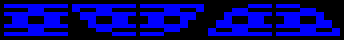
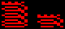
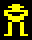
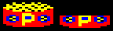
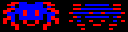
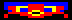
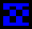

# Level editor

When first loaded, the level editor shows its main menu, with the
default Ghouls level set loaded.

From the level editor main menu, the following items are available:

- `1`, `2`, `3`, `4` - edit the corresponding level. See the editing
  section below
  
- `N` - set a level's name. Select level number then enter its new
  name. Level names are limited to 16 characters
  
- `T` - set the level set title, printed in the double height banner
  in the instructions screen. If not set, a default `G H O U L S` will
  be used
  
- `U` - set the level set-specific instruction text, printed as part
  of the instructions. (See the text editing section below.) If not
  set, obvious placeholder text will be shown
  
- `C` - set the level set-specific completion text, printed as part of
  the ending screen. (See the text editing section below.) If not set,
  obvious placeholder text will be shown
  
- `R` - reset a level's data. The level will be emptied, leaving just
  a row of blocks along the bottom and a few blocks underneath the
  standard treasure in the top right
  
- `L` - load levels. Enter file name. File names for the supplied
  level sets are given in the levels menu (if not obvious from
  `*CAT` - which hopefully it is). An entirely empty level set,
  `BLANK`, is also provided, if you want to start from a blank sheet
  
- `S` - save levels. Enter file name

- `I` - import a level from another level set. Enter file name, then
  enter level from that set to import, then enter level in the current
  set to replace. (Press ESCAPE at any point to abandon the process.)
  
  (You can use this feature to rearrange levels in the current level
  set. Save to a file then import from that file to shuffle them
  about)
  
- `E` - export screen shots

- `*` - enter `*` command prompt. Change drive and so on. Press ESCAPE
  to get back to the main menu
  
# Editing

When editing, you'll see the current level displayed in the top half
of the screen and a status area at the bottom.

To test the level shown, press `TAB`. You get one life, and you'll be
taken back to edit mode if you die or complete the level. (You can
always test again!)

To move the cursor, use the standard `Z`, `X`, `*` and `?` keys.

Use `←` and `→` to cycle through the list of objects available to
place in the level. The `NEW` indicator in the status area will update
to show the new object.

Some objects have an associated value, dictating their speed. When
appropriate, this is shown in the `#` field next to the object. Use
`↑` and `↓` to choose the value. (Note that `00` is a slightly special
value: unusually slow. Can come in handy if you want to be annoying.)

To place the `NEW` object in the level, press `RETURN`. Objects larger
than 1 cell are positioned by their top left.

To remove the object under the cursor, press `DELETE`. If the object
is larger than 1 cell, you'll have to delete its top left corner.

Levels have a level-specific colour, blue in original Ghouls level 1,
used for the floor tiles. Press `C` to cycle through the options.

(For performance reasons, the level editor isn't super careful about
always redrawing everything perfectly. Press `R` to redraw the level.)

## Object types

Ground, coloured according to the level-specific colour. The different
types are purely cosmetic and all behave the same way.

Deadly spikes. There are also 4 half-spike objects, also deadly, that
you can use.

Springs. Both types behave the same way, but the half height one only
uses up 1 row.

Edibles. To be edible while moving these need to be positioned at
player head height, i.e., with a 1 row gap between ground and edible.

There are also 2 individual edibles, should you need them.

Power pill. As with the edibles, this must be positioned at head
height to be edible while moving.

A general-purpose deadly red square, filling an entire cell.

A purely decorative player. (To set the player's start position, see
the Player start position section below.)

The decorative players are indistinguishable from the player start
position in the editor and you just have to remember which is which.

Decorative treasure. (The decorative treasure is purely decorative,
and plays no specific part in the level end position. See the Level
goal position section below.)

The bottom half treasure appears as the full size treasure in game,
but as it's a shorter object you can position it in the top row of the
screen.

Spiders. The masked/dimmed spider only appears when playing with 2+
ghosts, i.e., 2nd or subsequent time through the levels in classic or
infinite lives mode.

There are multiple speeds available. Speed 0 is unusually slow.

Spiders can't be placed right at the left or right edges of the map,
as they would overlap the level border.

Moving platform. 

There are multiple speeds available. Speed 0 is unusually slow.

Moving platforms can't be placed right at the left or right edges of
the map, as they would overlap the level border.

Moving floor.

There is only one speed available and it always extends from right to
left.

The moving floor can't be placed at the left edge of the map.

Goal. If the player steps on this, the level ends. See the Level goal
position section.

A general purpose vertical red line. There are two, one aligned with
the left edge of the cell and one with the right. This is used as the rope for the default level goal.

It behaves like the barrier at the edge of the level, and the player
can't walk through it.

## Player start position

Press `SHIFT`+`S` to set the player's start position, indicated by the
player sprite.

## Level goal position/treasure

By default, each level has a standard treasure-type goal in the top
right: a yellow line (the goal you need to step on), a red line (a
sort of rope kind of thing), and a treasure (not shown in the editor).

If you'd like additional level goals, or you'd like a level goal in
some other place, you'll need to disable this. Press `T` to do that.
(The current status is shown by the `ST` ("standard treasure")
indicator in the status area.)

If the standard treasure is off, you'll need to provide your own level
goal(s) somewhere. (Treasure is optional.) The end of level anim is
unfortunately not available in this case.

You can't combine standard treasure with additional goals.

## Inverted scoring

The default scoring mechanism adds points as you ascend the screen,
and subtracts points as you descend.

Press `I` to toggle this setting on a per level basis. (The current
status is shown by the `SI` ("scoring inverted") indicator in the
status area.)

When scoring is inverted, points are added as you descend and
subtracted as you ascend - as would make more sense if starting from
the top of the screen with the goal at the bottom.

## Ghost start position

By default, the ghost starts at some random position somewhere around
the middle of the level.

You can also set a ghost start area, so that the ghost always starts
in a specific region. Press `G` to set one corner of the ghost start
area and `SHIFT`+`G` to set the other corner. The ghost start area
will be indicated by a dotted red rectangle.

To clear the ghost start area, press `CTRL`+`G`. The ghosts will go
back to starting from some random position.

## Level testing stuff

Press `A` to toggle the test mode: time attack or score mode. (The
difference between Classic and Infinite Lives is largely moot in the
editor.) The current setting is shown in the `TA` ("time attack")
indicator in the status area: `Y` for time attack, `N` for score mode.

Press `SHIFT`+`3` (i.e., `#`) to cycle through the test mode ghost
count options. The current setting is shown in the `G#` ("ghost
count") indicator in the status area.

Press `S` to set the test start position, shown in red. When you test
the level using `TAB`, the player will start from the test start
position if set, to simplify testing sections of the level without
altering the normal start position.

(To unset the test start position, set it to the same position.)

To test the level always starting from the normal start position,
press `SHIFT`+`TAB`.

## Found a glitch? Seen something odd?

The Ghouls code does not cater for every situation possible, and (as
you will probably discover when testing) you can engineer some
surprising stuff without even having to try too hard.

It's also possible for the player to end up in infinite loops of dying
(press `ESCAPE` to exit testing if you get this) or to die in some
slightly surprising way.

As level designer, you will have to attempt to avoid these situations!

## Edit mode key reference

- `TAB` - test level
- `Z`, `X`, `*`, `?` - move cursor
- `DELETE` - delete thing under cursor
- `←`/`→` - select NEW thing type
- `↑`/`↓` - select NEW thing value
- `RETURN` - add an instance of the NEW thing to the level
- `A` - toggle test mode game type
- `C` - change the level-specific colour
- `G` - set one corner of the ghost start position area
- `SHIFT`+`G` - set the other corner of the ghost start position area
- `CTRL`+`G` - unset the ghost start position area
- `I` - toggle the invert score flag
- `R` - redraw the level
- `S` - set the player's test start position
- `SHIFT`+`S` - set the player's start position
- `T` - toggle presence of standard treasure or not (see below)
- `SHIFT`+`3` (`#`) - cycle the number of ghosts
- `SHIFT`+`TAB` - test the level, always using the level start position
- `ESCAPE` - return to main menu

# Text editing

There's an extremely basic (if we're being polite) text editor kind of
thing (for a very loose definition of "kind of thing") for editing
completion text and instruction text. Navigate using the cursor keys,
`DELETE` to delete backwards, `SHIFT`+`DELETE` to delete forwards, and
press keys to insert chars.

The whole text is treated as one big string, rather than separate
lines, so inserting text at the start will affect subsequent lines and
you'll have to fix it all up by hand.

There's an invisible runoff area after the end of the editor text, so
anything that goes off the end is not immediately lost! If you delete
chars, you'll see it come back. What's visible is all that gets saved
to the level data though.

The end of the text, if that comes before the end of the visible area,
is indicated by a solid white square, which you can insert with
`SHIFT`+`f0`. Anything after the first one will be discarded. This is
more important for the instructions text as whatever comes next will
follow on immediately.

## Instructions text editing

Press `SHIFT`+`f1` ... `SHIFT`+`f7` to insert teletext colour control
codes.

## Completion text editing

Press `CTRL`+`P` to see the text in an approximation of the Mode 5
screen it's shown as in game.
